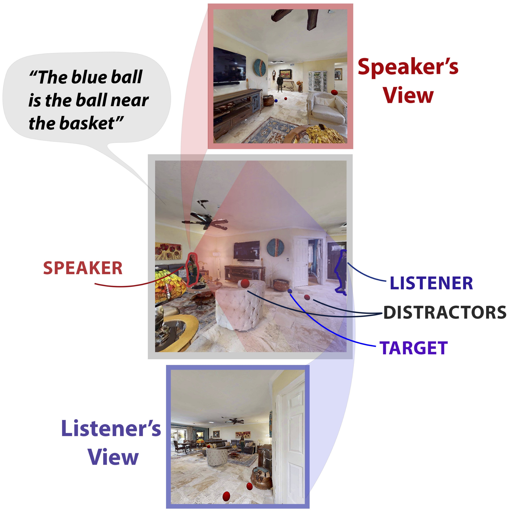

# PersRefEx
## Dataset


## Table of Contents

- [📖 Introduction](#-introduction)
- [📁 Dataset](#-dataset)
- [📚 Citation](#-citation)

## 📖 Introduction

PersRefEx is a comprehensive dataset and platform designed to facilitate research in multi-perspective referential communication within photorealistic 3D environments. This project enables the study of how embodied agents (both human and AI) communicate about their surroundings from different viewpoints, aiming to achieve *communicative success*—where the listener accurately understands the speaker's intended referent.
<p align="center">

</p>

## 📁 Dataset

[Huggingface Dataset](https://huggingface.co/datasets/ZinengTang/PersReFex)

[Google Drive](https://drive.google.com/drive/folders/19-8eBi4JJ_sU0qKsQ31dE3743NE--4bv?usp=drive_link)

### Overview

The PersRefEx dataset comprises:

- **2,970** human-written referring expressions.
- **1,485** generated scenes.
- **27,504** sampled scenes with varying agent perspectives and referent placements.

### Citation
```
@misc{tang2024groundinglanguagemultiperspectivereferential,
      title={Grounding Language in Multi-Perspective Referential Communication}, 
      author={Zineng Tang and Lingjun Mao and Alane Suhr},
      year={2024},
      eprint={2410.03959},
      archivePrefix={arXiv},
      primaryClass={cs.CL},
      url={https://arxiv.org/abs/2410.03959}, 
}
```
